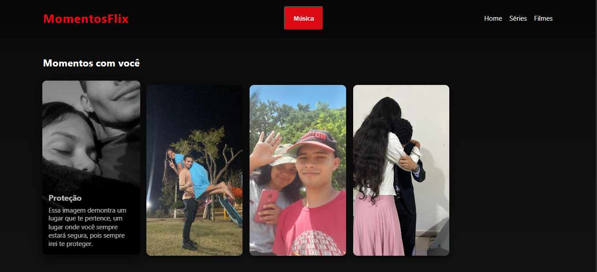

# 🎬 MomentosFlix

Um projeto pessoal inspirado na Netflix, desenvolvido por **Lucas Rosa** com **HTML, CSS e JavaScript**.  
O objetivo é criar uma galeria interativa para registrar e compartilhar momentos especiais com estilo moderno.

---

## ✨ Funcionalidades

- 🎵 Botão para **tocar/pausar música de fundo**  
- 📸 **Cards interativos** com imagens e descrições personalizadas  
- 🖼️ Layout em **grid** para organizar os momentos  
- 📱 **Responsividade completa** (desktop, tablet e celular)  
- 📝 Ao clicar em um card, aparece um **alert com a descrição**  
- ♿ **Acessibilidade**: foco por teclado nos cards  
- 📅 **Ano automático** no rodapé via JavaScript  

---

## 🛠️ Tecnologias utilizadas

- **HTML5** → Estrutura da página  
- **CSS3** → Estilos, layout responsivo e animações  
- **JavaScript** → Interatividade (música, alerts, acessibilidade, ano dinâmico)  

---

## 📸 Preview

